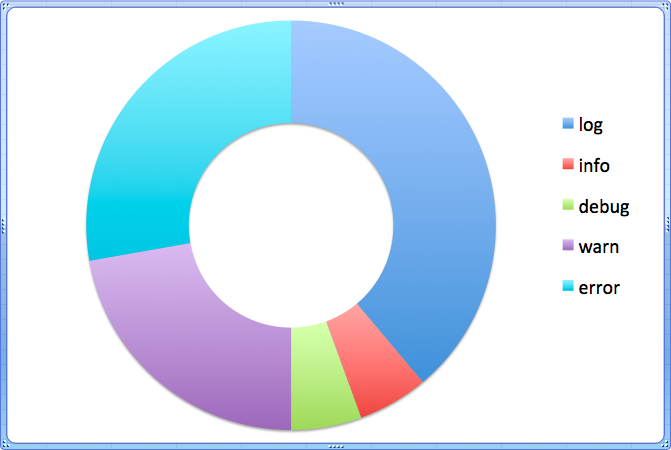

class: middle, slide-invert-colors

.size60[

# Pokaż mi logi aplikacji,<br/>a powiem Ci jak ona działa!

]


---

class: middle, slide-invert-colors, slide-fullscreen-background
background-image: url(images/IMG_6239-08.png)

# O mnie

???

* utrzymywałem jednocześnie 10 aplikacji webowych
* napisałem własny system zbierania logów
* ...

---

class: middle, slide-background-red

# Logowanie danych w aplikacji webowej

## Chapter 1

---

class: middle, slide-background-red

## <mark>Q</mark> Jaki znacie sposoby wyświetlania<br/>danych podczas developmentu?

---

class: slide-background-red

### Wyświetlanie danych — basic

.size20[

* `console.log`
* `console.info`
* `console.debug`
* `console.warn`
* `console.error`

]

---

class: slide-background-red

### Wyświetlanie danych — advanced

.size20[

* `console.assert`
* `console.exception` — Firefox
* `console.dir`
* `console.count`
* `console.context`
* `console.table`
* `console.group[Collapsed][End]`
* `console.profile[End]`
* `console.time[End]`
* `console.trace`

]

---

class: middle, slide-background-red

## <mark>Q</mark> Różnice?

---

class: slide-background-red

### Moja definicja

* `log` - wyświetlenie tymczasowych danych
* `info` - zaznaczenie danego miejsca w celach czysto informacyjnych
    + nie developerskich
    + istnieją takie miejsca w kodzie, które trzeba koniecznie "wylogować"
* `debug` - wyświetlenie wartości <u>w celach developerskich</u>, która będzie
    pomocna w przyszłości, aby przeprowadzić analizę aplikacji
* `warn` - zaznaczenie szczególnej sytuacji, która może powodować błąd aplikacji
* `error` - powiadomienie o sytuacji, w której występuje błąd PRZECHWYCONY przez
    aplikację

---

class: center, slide-background-red

## Popularność użycia <small><mark>(w 7 os. zespole)</mark></small>



---

class: slide-background-red

### Ankieta — `console.log()`

.size20[

* Printowanie na konsolę jakichkolwiek informacji (używam w procesie
    developmentu do printowania obiektów/zmiennych/odpowiedzi z usług)
* Zwykły log do konsoli
* Od słowa `log` czyli dziennik aktywności w aplikacji. Filtrując komunikaty
    wyłącznie po logach powinniśmy czytając wiedzieć, co się dzieje aktualnie
    w aplikacji bez patrzenia na render
* Logowanie do konsoli przeglądarki informacji ogólnych
* **Używam `console.log()` raczej tylko do debugowania, nie używam innych funkcji
    obiektu `Console`, wolę sobie narysować interesującego mnie loga poprzez
    log poprzedzający `console.log('/////////////////////////////////')`,
    bo jestem raczej wzrokowcem i szybciej mi się wzrok skupia na takim
    narysowanym logu**
* Info dla developera, wyplucie dowolnej, potrzebnej na bieżące potrzeby rzeczy
* Logowanie informacji użytecznych głównie dla deweloperów

]

---

class: middle, slide-background-red

## <mark>Q</mark> Zgadzacie się z tą teorią?

---

class: slide-background-red

### Ankieta — `console.info()`

.size20[

* Printowanie na konsole treści informacyjnych (nie używam)
* Podobnie jak pierwszy, tylko chyba się wyświetla ikonka `i` czasem (nie używam)
* Prezentuje informacje, które nie są oczywiste z punktu widzenia aplikacji
* Podobnie jak `console.log` z możliwością pofiltrowania w przeglądarce
* **Nie widziałem nigdy potrzeby rozgraniczenia na `console.log` i `console.info`**
* Tutaj mam problem z rozróżnieniem kiedy `.info`, a kiedy `.log`
* Coś, co daje obraz, że jakaś rzecz się wykonała (bo np. coś od niej zależy,
    wiec chcemy wiedzieć, że jeśli rzecz B się wywala, to dlatego, że A nie
    poszła)
* Logowanie informacji pomocniczych

]

---

class: slide-background-red

### Ankieta — `console.debug()`

.size20[

* Printowanie na konsole treści debugowych (nie używam)
* **Chyba alias do `console.log` (nie używam)**
* Informacje developerskie
* Logowanie tylko pokaże się dopiero gdy w przeglądarce jest zaznaczony
    Verbose, defaultowo opcja wyłączona.
* Jak wyświetlam informację którą aktualnie debuguje, z tego co widzę pojawiła
    się taka opcja stosunkowo niedawno.
* Podczas debugowania
* Logowanie informacji użytecznych głównie dla developerów

]

---

class: slide-background-red

### Ankieta — `console.warn()`

.size20[

* Printowanie na konsole treści ostrzegających o czymś (używam do wyświetlenia
    ostrzeżeń/błędów niekrytycznych dla aplikacji)
* Wrzuca warning do konsoli, wyświetla się w innym kolorze z ikonką `!`
* Ostrzeżenie przed nietypową (ale obsłużoną) sytuacją
* **Logowanie do konsoli z komunikatem ostrzeżenia, ale nie krytycznego
    tak jak w przypadku `error`**
* Jak chce wyświetlić informację którą nie można ignorować
* Jak nazwa wskazuje, jakieś ostrzeżenie, coś się dzieje, ale pacjent jeszcze
    oddycha!
* Logowanie ostrzeżeń, drobnych błędów nie mających krytycznego znaczenia
    dla działania aplikacji

]

---

class: slide-background-red

### Ankieta — `console.error()`

.size20[

* Printowanie na konsole treści z błędem (używam do wyświetlenia błędów
    krytycznych aplikacji - np. błąd zapytania do usługi XYZ)
* Wrzuca error do konsoli, wyświetla się na czerwono i dostępny jest kontekst błędu
* Ostrzeżenie przed nietypową (nieobsłużoną) sytuacją
* Logowanie do konsoli informacji o błędzie
* Użyje jak chce wyświetlić błąd krytyczny
* Jeśli chcemy lognąć coś z errora
* **Wykrzaczenie, spodziewany błąd (do zastosowania przy obsłudze błędów)**
* Logowanie błędów krytycznych

]

---

class: middle, slide-invert-colors

# DEMO ✨ Zdebugujmy coś!

Visual Studio Code plugin: Turbo Console Log

<https://scotch.io/bar-talk/consolelog-faster-with-turbo-console-log>

???

* skrót na dodanie `console.log`
* usuwanie wszystkich `console.log` z kodu

---

class: middle, slide-background-brown

# O tym dlaczego `console.log` to półśrodek

## Chapter 2

???

* logowanie danych we front-endzie
* logowanie danych z front-endu do back-endu
* dane muszą pochodzić w różnych miejsc / komponentów

---

class: middle, slide-background-brown

# Muszę się Wam do czegoś przyznać...

---

class: slide-background-brown

### Filtrowanie <small>(Glob Pattern)</small>

.size25[

```javascript
// player.js
const debug = require('debug');
const console = {
    log: debug('app:player:log'),
    info: debug('app:player:info'),
};

// navigation.js
const console = {
    log: debug('app:navigation:log'),
    info: debug('app:navigation:info'),
};
```

]

W DevTools Console -> `localStorage.debug = "player:*"`

---

class: middle, slide-background-brown

# Przykład

<https://stackblitz.com/>

---

class: slide-background-brown

### ✅ Plusy za nadpisywaniem

.size20[

* **Dane mogą pochodzić z kilku komponentów!**
* Możemy dalej używać wszędzie naturalnego systemu do debugowania,
    np. `console.log`, `console.error`, `console.warn`
* Nadpisywanie dodaje nam prefix do każdego `console.log`, dodając do niego
    informację o module z którego pochodzi
* Na produkcji użytkownicy nie widzą naszych logów, które zawsze będą w aplikacji
* Mamy możliwość włączenia `console.log`-ów na produkcji
* Nie musimy uczyć się nowego sposobu korzystania z logów
* Nie musimy usuwać wszystkich `console.log`-ów obecnych (nie możemy wystawiać
    aplikacji dla klienta z naszymi logami)
* **Nie będziemy musieli odrzucać Pull Requestów, jeśli developer napisze `console.log`**
* Bardzo łatwo jest przejść z trybu logów ZAWSZE widocznych (natywny obiekt)
    do logów PRAWIE widocznych (kiedy nadpiszemy w danym pliku obiekt `console`)

]

---

class: slide-background-brown

### ⛔️ Minusy

.size40[

* Nadpisujemy obiekt <u>globalny</u>, który może być wykorzystany przez różne
    funkcje

_Ale czy na pewno?_

]

---

class: slide-background-brown

### Narzędzia

* debug — <https://github.com/visionmedia/debug>
    + for Node.js, for browser
* winston — <https://github.com/winstonjs/winston/>
    + for Node.js
* node-bunyan — <https://github.com/trentm/node-bunyan>
    + for Node.js
* tracer — <https://github.com/baryon/tracer>
    + for Node.js
* bristol — <https://github.com/TomFrost/Bristol>
    + for Node.js

---

class: middle, slide-background-green

# Monitoring aplikacji

## Chapter 3

???

* zapisywanie logów w back-endzie do bazy danych
* prezentacja diagramów na podstawie logów w panelu admina
    + Bar charts

---

class: slide-background-green, slide-fullscreen-content
background-image: url(images/nasa-monitoring.jpg)

---

class: middle, slide-background-green

# Składowe

.size40[

* Access logi
* Error logi
* _Metryki_

Ile trwa średnio obsłużenie requestu<br/>po stronie serwera?

]

---

class: center, slide-background-green

## "Metryki do wszystkiego" <small>Marcin Operacz</small>

<video
    style="width: 800px;"
    src="videos/metryki-do-wszystkiego.mov"
    preload="false"
    controls
></video>

<https://www.youtube.com/watch?v=P818c0LXV04>

---

class: slide-background-green

### Własna usługa — Collecting

* Ogólne
    + Odbieranie danych — REST / WebSockets (Socket.io?)
    + Zapisywanie danych — MongoDB
        - NoSQL jest bardziej elastyczne od Relacyjnych
    + Retencja danych
* Dla front-endu
    + protokół = https
    + host = domena
* Dla back-endu
    + protokół = http — po co https?
    + host = ip, lokalnej maszyny, po co domena?

---

class: slide-background-green

### Własna usługa — Monitoring

* Dostęp
    + możliwy z zewnątrz za pomocą VPN-a
* UI
    + zdefiniowanie pól do wyświetlenia
    + filtrowanie po polach & dacie
    + paginacja

Dla Power Userów:

* Kolejka, zbierająca logi

---

class: middle, slide-invert-colors

# DEMO ✨ WebSockets

???

Prezentacja na żywo interakcji ze stroną <https://piecioshka.pl/blog/>

---

class: middle, slide-background-green

## <mark>Q</mark> Czy jest sens, aby tworzyć i utrzymywać własnę usługę do zbierania logów w 2019?

---

class: slide-background-green

### Usługi

* Sentry — <https://sentry.io>
* Elastic — <https://www.elastic.co/products/apm>
* **Graylog — <https://www.graylog.org/> **
* Splunk — <https://www.splunk.com/>
* New Relic — <https://newrelic.com/>
* Data Dog HQ — <https://www.datadoghq.com/>
* **Sumo Logic — <https://sumologic.com/> **
* Azure Insights
* Stack Impact — <https://stackimpact.com/>
* Keymetrics — <https://app.keymetrics.io/>

---

class: middle, slide-invert-colors

# DEMO ✨ PM2

???

<https://workshop-nodejs-facebook.herokuapp.com/>

---

class: middle, center, slide-background-purple

## Najpopularniejsza biblioteka pod względem ilości ściągnięć w tym tygodniu

# debug

"40 million weekly downloads"

.size20[

Źródło: <https://snyk.io/blog/npm-passes-the-1-millionth-package-milestone-what-can-we-learn/>

]

---

class: middle, center, slide-invert-colors, no-display-my-logo

# <samp>Dziękuję!</samp>


.size30[
» [fb.com/piecioshka.trener](https://fb.com/piecioshka.trener) «
]
